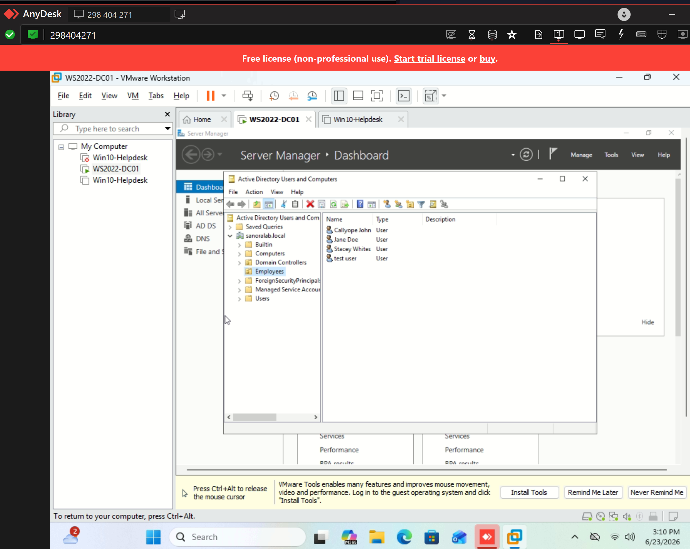

# Active Directory Practice – Creating Users

## Date
06/23/2026

## What I Did
- Opened Active Directory Users and Computers 
- Created multiple domain user accounts inside an Organizational Unit 

## Skills Practiced
- Navigating ADUC 
- Creating new user objects
- Setting initial passwords
- Understanding OUs and where users should be stored

## Tools Used
- Server Manager
- Active Directory Users and Computers 

## What I Learned
- How to create domain users in Active Directory
- How OUs help organize users in a domain
- Basics of domain administration

## Screenshot of Users Created

